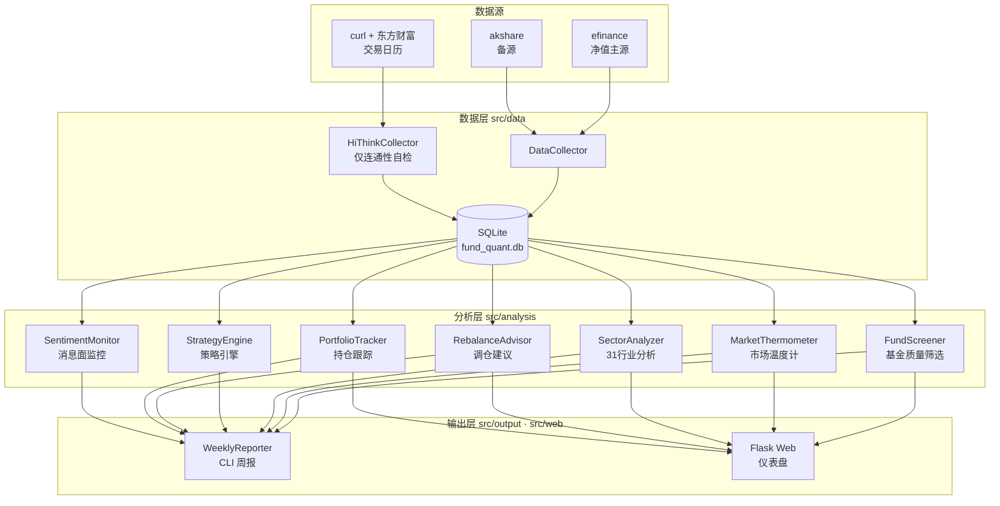

# 自动化基金量化系统

> 🎓 大学生量化基金投资助手 | 场外基金 · 每周信号 · 半自动执行

**目录**

- [这是什么？](#这是什么) —— 它做什么 / 不做什么 / 核心理念
- [快速开始](#快速开始) —— 装依赖 → 初始化 → 看结果 → 起网页
- [日常命令](#日常命令) —— 记录操作、定投、刷新净值
- [数据与隐私](#数据与隐私) —— ⚠️ 本仓库是公开的，先读这节
- [项目结构](#项目结构) · [系统架构](#系统架构) · [技术选型](#技术选型)
- [口径说明](#口径说明) —— 质量筛选 / 市场温度计 / 交易与账务规则
- [测试](#测试)
- [回测与研究](#回测与研究v30) —— 负结果、研究模块、如何复现
- [你的使用场景](#你的使用场景) · [当前约束](#当前约束v01) · [License](#license)

---

## 这是什么？

一个面向**个人投资者（尤其是资金有限的大学生）**的量化基金分析工具。

**它做什么**:
- 📡 采集全市场基金数据、指数估值、行业行情（净值走 efinance→akshare 回退；交易日历走 curl + 东方财富；同花顺 HiThink 目前仅作连通性自检，未接入采集链路）
- 🔍 基金质量筛选：基于费率、规模、经理稳定性等多维检查输出三色评级（🟢稳健 / 🟡注意 / 🔴高风险）
- 🌡️ 计算"市场温度"，判断当前是便宜还是贵（PE/PB 分位 + 股债性价比 + 成交量 + 情绪五维）
- 📊 31 个申万行业板块动量排名 + 超跌候选
- 🔄 严谨回测引擎 v3：防未来函数（扩展窗口分位数）+ 交易成本计入指标（净收益）+ 双指数基准（按**日期**对齐）+ alpha t 检验
- 📋 跟踪你的持仓，按**本地库净值**计算收益和风险（读路径不联网），输出调仓建议
- 📅 定投（DCA）管理：登记计划、按交易日自动排期、到期提醒、一键执行并累计
- ✏️ 持仓可增删改（buy / sell / update / delete），方便更正录入错误
- 📝 每周生成操作建议报告，支持 CLI 与 Web 仪表盘两种入口

**它不做什么**:
- ❌ 不自动下单（场外基金不支持API交易）
- ❌ 不预测下周涨跌（短期不可预测）
- ❌ 不承诺稳赚不赔（投资有风险）

## 核心理念

```
用数据替代情绪做基金买卖决策。

不追涨杀跌 → 估值低时多买，估值高时谨慎
不选冠军 → 选综合质量好、费率低的基金
不频繁操作 → 每周看一次，长期持有
```

## 快速开始

### 1. 安装依赖

```bash
pip install -r requirements.txt
```

### 2. 一键初始化（首次使用执行一次）

```bash
python src/main.py init
```

自动完成五步：测试数据接口 → 采集基金列表与指数估值 → **刷新交易日历** → 采集基金净值历史 → 补充基金详情
（实测约 15-25 分钟，净值采集最耗时；`enrich` 会另花几分钟补规模/经理）。

> 也可以分步执行：`python src/main.py test` / `collect` / `calendar` / `nav` / `enrich`
> 采集类命令跑完会自动失效 Web 缓存快照，回到页面即可看到新数据。

### 3. 查看分析结果

```bash
# 生成完整周报
python src/main.py

# 或者单独查看:
python src/main.py score     # 基金质量筛选（只排除有坑的，不做评分排名）
python src/main.py temp      # 市场温度
python src/main.py portfolio # 持仓概览
```

### 4. 启动 Web 仪表盘

```bash
python src/main.py precompute  # 可选：预计算快照（温度/筛选池/板块总榜），首屏免冷算
python src/main.py web         # http://localhost:5020（仅监听本机）
# 想同时跑第二份（对照/调试）：QFA_PORT=5021 python src/main.py web
```

## 日常命令

```bash
python src/main.py buy       # 记录买入（交互式）
python src/main.py sell      # 记录卖出（交互式）
python src/main.py update    # 修改持仓（投入金额/买入日期）
python src/main.py delete    # 删除持仓（处理重复录入）
python src/main.py dca       # 定投管理（list/add/run/pause/resume）
python src/main.py refresh   # 刷新持仓的最新净值（唯一会联网的持仓相关命令）
python src/main.py          # 生成完整周报
```

> 除 `refresh` / 采集类命令外，持仓与分析的**读路径不联网**（只读本地 `data/fund_quant.db`）。

## 数据与隐私

⚠️ **本仓库是公开的**（`github.com/Mo12y/Quantitative-Fund-auto`），请先读完本节。

**已经在公开历史里的个人数据**：`src/analysis/investment_plan.py` **曾经**把投资计划**硬编码**在源码里，
包含真实基金代码、金额、日期（例如计划总额 1000 元、现金弹药 280 元、各笔买入的日期与金额）。
无账号、无身份信息，但足以还原你的持仓结构 —— 这些内容**已经推送到公开仓库且存在于历史提交中**
（即便现在已外置，历史提交里仍有，见下表第二行）。

**2026-09-25 起：计划已外置**（F-01）。源码里只保留一份**示例**计划，真实计划在
`config/investment_plan.local.yaml`（**已 .gitignore**）。读取优先级：
数据库 `investment_plans` 表 → 本地配置 → 内置示例。新用户复制
`config/investment_plan.local.example.yaml` 即可起步。

**不受影响的**：数据库与运行时产物**不会**入库（`.gitignore` 覆盖 `*.db` / `*-wal` / `*-shm`、
`data/backups/`、`data/cache/`、`data/*_results/`）；`docs/screenshots/` 也已忽略
（那几张截图是真实持仓界面，比源码更直观）。

**如果你想脱敏**，两个层次：

| 做法 | 效果 | 状态 |
|---|---|---|
| 把 `FUNDS` / `TOTAL_CAPITAL` 抽到本地配置文件（`config/investment_plan.local.yaml`）并加进 `.gitignore` | 之后的提交不含真实数据 | ✅ **已实现**（2026-09-25，F-01）。源码只留示例计划；真实计划在本地文件里 |
| 用 `git filter-repo` / BFG 重写历史后强推 | 连历史里的数据也清掉 | ⏳ 未做（会**改写公开历史**，其他人的 clone / fork 会不一致，需谨慎） |

其余数据说明：
- 系统只读公开市场数据（基金净值、指数估值、行业行情），不涉及任何账户/交易凭证；
- 没有任何下单能力（场外基金不支持 API 交易），所有操作都需要你在支付宝手动执行。

## 项目结构

```
Quantitative-Fund-auto/
├── config/
│   └── settings.yaml            # 配置（因子权重、温度阈值、仓位映射等）
├── docs/                        # 📄 文档
│   ├── 使用指南.md              #   面向使用者的完整教程
│   ├── 参考项目复盘-v3阶段借鉴.md #  设计取舍记录
│   ├── vol_prediction_report.md      #   波动率预测（脚本生成，可重跑）
│   ├── vol_model_comparison_report.md#   多模型对比（脚本生成）
│   ├── drawdown_warning_report.md    #   回撤预警（脚本生成）
│   ├── portfolio_simulation_report.md#   组合模拟（脚本生成）
│   ├── factor_test_report.md         #   因子检验（脚本生成）
│   └── *_final_review.md / *_risk_report.md  # 手写复盘（**已标注过期**，见文首横幅）
├── src/
│   ├── data/                    # 数据层
│   │   ├── collector.py         #   akshare/efinance 数据采集
│   │   ├── hithink_collector.py #   同花顺 API（仅 hithink 连通性自检，未接入采集）
│   │   └── database.py          #   SQLite 数据库
│   ├── cli/                     # CLI 命令包（按职责拆分）
│   │   ├── data_cmds.py         #   数据采集命令
│   │   ├── analysis_cmds.py     #   分析命令
│   │   ├── backtest_cmds.py     #   回测命令
│   │   └── output_cmds.py       #   输出/操作命令
│   ├── config.py                # 配置中心（settings.yaml 类型化访问）
│   ├── analysis/                # 分析层
│   │   ├── fund_scorer.py       #   基金质量筛选（三色评级）
│   │   ├── thermometer.py       #   市场温度计（5维+分歧检测+风格判断）
│   │   ├── backtest.py          #   严谨回测引擎 v3（防未来函数/净收益/双基准按日期对齐/t检验）
│   │   ├── portfolio.py         #   持仓跟踪（T+1 确认/份额/盈亏/组合曲线；只读本地库）
│   │   ├── trade_rules.py       #   交易规则纯函数（15:00 截止/顺延/确认日/起算日）
│   │   ├── dca.py               #   定投管理（交易日排期/期次对账/补录）
│   │   ├── fund_boards.py       #   基金→行业板块归类与占比
│   │   ├── vol_predictor.py     #   波动率预测（离线研究）
│   │   ├── drawdown_warning.py  #   回撤预警（离线研究）
│   │   ├── portfolio_simulation.py    # 组合模拟（离线研究）
│   │   ├── vol_model_comparison.py    # 波动率多模型对比（离线研究）
│   │   ├── factor_test.py       #   因子检验（离线研究）
│   │   ├── strategy_engine.py   #   策略引擎（月频+温度阈值）
│   │   ├── rebalance_advisor.py #   调仓建议
│   │   ├── sentiment_monitor.py #   消息面监控
│   │   ├── sector_analyzer.py   #   31行业板块分析
│   │   ├── historical_recommender.py # 历史回测推荐
│   │   └── investment_plan.py   #   投资计划
│   ├── output/
│   │   └── reporter.py          #   周报生成
│   ├── web/                     # 🌐 Web 仪表盘
│   │   ├── app.py               #   Flask 后端 API（内存缓存→SQLite 快照→现算）
│   │   ├── templates/
│   │   │   └── dashboard.html   #   页面骨架（CSS/JS 外链，无构建链）
│   │   └── static/              #   前端资源（原生 JS，无打包）
│   │       ├── app.css          #     样式（DESIGN.md 令牌）
│   │       └── app.js           #     渲染与交互
│   └── main.py                  # 🚀 主入口（CLI 分发，命令在 src/cli/）
├── scripts/                     # 🔧 运维脚本（写库类默认 dry-run）
│   ├── build_trade_calendar.py  #   交易日历（curl + 东方财富）
│   ├── rebuild_costs_dryrun.py  #   历史成本重算对照表（只读）
│   ├── link_dca_periods.py      #   定投期次补凭证（--apply 才写库）
│   ├── backfill_sell_fees.py    #   历史卖出赎回费回填（--apply 才写库）
│   └── backfill_index_volume.py #   指数成交量回填（curl + 新浪；--apply 才写库）
├── tests/                       # ✅ 单元测试（390 个用例，pytest）
├── data/                        # 数据库文件（gitignore）
├── requirements.txt
└── README.md
```

## 系统架构



## 技术选型

| 组件 | 选型 | 理由 |
|------|------|------|
| 数据源 | efinance（净值主）+ akshare（备）+ curl + 东方财富（交易日历） | 净值历史优先 efinance（更稳、含累计净值），失败回退 akshare；Python 直连外网不稳时交易日历用 curl 子进程；同花顺 HiThink 仅保留连通性自检 |
| 存储 | SQLite（WAL） | 单机个人使用，零配置零运维；当前 **2.79 万只基金基本信息 + 2,290 万条净值记录**的量级完全够用；已开 WAL + busy_timeout，配合 Flask 多线程降低锁冲突 |
| 语言 | Python 3.10+ | 金融数据生态成熟（pandas / numpy） |
| CLI | rich | 终端彩色输出、表格、进度条，报告可读性好 |
| Web | Flask | 轻量，单文件即可起服务，适合个人工具 |
| 配置 | YAML | 策略参数（因子权重、温度阈值、仓位映射）与代码分离 |

## 口径说明

系统的三个"会直接影响你看到的数字"的规则集。改这三处之前请先读对应小节。

| 规则集 | 作用 | 详细位置 |
|---|---|---|
| 质量筛选 | 决定哪些基金进池、贴什么风险标签 | 见下「质量筛选模型」 |
| 市场温度计 | 温度 → 建议权益仓位（连续插值，非阶梯） | 见下「市场温度计」 |
| 交易与账务 | T+1/T+2 定价日、份额、赎回费、已实现盈亏 | [使用指南](docs/使用指南.md) + [前端优化设计方案 §3.5](docs/前端优化设计方案.md) |

**账务单一真源**：赎回费率只在 `portfolio.redeem_fee_rate` 定义一次
（持有 <7 天取基金自身费率与监管下限 1.5% 孰高；**≥7 天为 0**），
回测与策略引擎一律从它导入，不再各自维护费率表。

## 质量筛选模型

**不做加权评分排名**（v3 起改为只排除有坑的）。6 个维度各自做通过/警告/不通过判定，
再汇总为三色风险标签：

| 维度 | 判定依据 |
|------|------|
| 成立年限 | 成立不足 12 个月 → 不通过 |
| 规模 | <0.5 亿（清盘风险）/ >200 亿（不灵活） |
| 费率 | 管理费+托管费 >2.0% → 不通过，>1.5% → 警告 |
| 回撤控制 | 近 1 年最大回撤 >35% → 不通过 |
| 动量 | 近 3 月涨幅 >40% → 追涨警告（高动量不加分、反而警示） |
| 风险调整收益 | 夏普为负 → 不通过 |

> ⚠️ 数据可得性：`fund_info` 中 `fund_size` 对约 **98%** 的基金为空、`mgt_fee` 对长历史
> 基金普遍缺失。缺失时这两个维度显示"无数据(跳过检查)"，即**不参与筛选**，
> 而不是静默算通过。CLI 里费率缺失显示为「无数据」而非 `0.00%`。

## 市场温度计

| 温度 | 状态 | 建议操作 |
|------|------|----------|
| 0-20°C | 🧊 极冷 | 可大胆加仓 |
| 20-40°C | 💧 偏冷 | 适度加仓 |
| 40-60°C | 🌤️ 适中 | 保持定投 |
| 60-80°C | 🔥 偏热 | 减少买入 |
| 80-100°C | ☀️ 过热 | 考虑减仓 |

## 运行示例

**市场温度计**（`python src/main.py temp`，离线读本地库；实际输出）：

```
🌡️ 市场温度计 v2.0
==================================================
  [███████████░░░░░░░░░] 56.3°C
  状态: 🌤️ 适中
  建议: 正常水平，保持定投
  建议权益仓位: 28.8%

  📊 五维分解:
    PE估值分位数:  56°  (越高越贵)
    PB估值分位数:  36°  (越高越贵)
    股债性价比:    39°  (越高股票越贵)
    成交量热度:    94°  (天量=高温)
    市场情绪:      57°  (贪婪=高温)

  🔍 估值分歧度: 轻微分歧
     估值信号有分歧，建议结合其他信息判断
```

> 五维中的任一项若数据缺失，会**剔除该维度并按剩余权重重新归一化**，并在输出里提示
> "数据缺失维度已剔除…"，而不是静默填 50° 冒充中性读数。

**基金质量筛选**（`python src/main.py score`）：

```
🔍 基金质量筛选 v3.0

🌡️ 当前市场温度: 56.3°C — 🌤️ 适中

📊 筛选结果: 30只通过质量筛选
   🟢 稳健: 30只

──────────────────────────────────────────────
🟢 稳健:
  008348 中信建投甄选混合C            费率无数据      近3月+7%  回撤19%
  007029 易方达中证500ETF联接发起式C    费率无数据      近3月-7%  回撤18%
  005940 工银新能源汽车主题混合C        费率无数据      近3月-13%  回撤24%
  ...
```

**Web 仪表盘**（`python src/main.py web`）：浏览器打开 http://localhost:5020，可视化查看市场温度、仓位建议、基金质量池、31 行业排名等。

## 测试

```bash
python -m pytest tests/ -q
```

共 **390** 个用例，覆盖市场温度计（分级/边界/估值分歧/缺失维度降级）、T+1/T+2 交易规则与持仓落账、
定投期次推算与期次对账、组合累计曲线、投资计划 CRUD、基金筛选与板块归类、Web 写入 API、
回测成本与日期对齐、组合模拟的信号滞后、回撤标签的复权口径、因子检验口径、
同侪百分位参照系（样本不足显式声明 / 门槛修正 / 回归哨兵）、TER 费率口径与组内分位等；
纯逻辑用例无需数据库与网络（净值只读本地库，读路径不联网）。

## 回测与研究（v3.0）

`python src/main.py backtest3`

相比 v1/v2 的规则回测，v3 建立了严谨的回测框架：

| 维度 | 升级 |
|------|------|
| 防未来函数 | PE 温度改用**扩展窗口分位数**（只用当日及之前数据），信号不含未来信息 |
| 交易成本 | 申购费 + 赎回费（真源 `portfolio.redeem_fee_rate`）+ 管理费摊销，**全部计入净收益** |
| 双基准 | 沪深300 / 中证500，与策略**按日期 inner join 对齐**（非按位置截断） |
| 统计检验 | 月度 alpha 的 **t 检验**（真 t 分布，H0: alpha=0）、Beta 回归 |
| 一致性 | 逐年收益按**自然年**（收益实现月）分解 |

> `等权基金组合`这个基准**没有实现**（早期文案曾承诺过）。报告里的 alpha 是相对两个指数算的，
> 不等于"跑赢把所有基金等权买一遍"。

**回测结果（2021-10 ~ 2026-08 · 59 个月 · 净收益）**（`lookback_years=5`，自然月末网格）：

| 指标 | 策略 | 沪深300 | 中证500 |
|------|------|---------|---------|
| 总收益 | +45.4% | — | — |
| 年化收益 | +7.9% | -1.0% | +2.3% |
| 年化波动 | 32.4% | — | — |
| 夏普 | 0.24 | -0.06 | 0.10 |
| 最大回撤 | 43.5% | 34.9% | 37.0% |
| Calmar | 0.18 | — | — |
| 月胜率 | 52% | — | — |
| 月度 alpha | — | +1.03%（p=0.3816，不显著） | +0.65%（p=0.5611，不显著） |

逐年（自然年）：2021 +3.1% / 2022 −29.5% / 2023 −6.3% / 2024 −8.0% / 2025 +41.2% / 2026 +64.4%。

**结论：策略 alpha 均不显著（p 远大于 0.05），且逐年极不稳定（2022、2024 大幅跑输）——「温度→仓位」策略未产生统计上可验证的超额收益。**

### 策略改进验证（backtest4 · 三组对照）

基于负结果提出假设「选基权重过度防御导致牛市跑输」，并做对照实验验证：

| 策略 | 年化 | 夏普 | 最大回撤 | 月胜率 | alpha vs 沪深300 |
|------|------|------|---------|--------|-----------------|
| 买入持有（基线） | -2.9% | -0.13 | 44.5% | 48% | -0.08%/月（p=0.88） |
| 温度阈值调仓（现状） | +7.9% | 0.24 | 43.5% | 52% | +1.03%/月（p=0.38） |
| 温度自适应选基（改进） | +2.5% | 0.08 | 38.6% | 49% | +0.60%/月（p=0.60） |

**研究结论**：
1. 改进假设**被证伪**——「温度自适应选基」年化（+2.5%）明显差于现状（+7.9%），问题不在选基权重
2. **「主动调仓大幅降回撤」这个旧结论不成立**——按修正后的口径，买入持有 44.5% vs 现状 43.5%，
   只差 1pp（旧文案曾写"49.3%→33.2%"，那是错误的采样网格 + 未计成本造成的假象）
3. 所有策略 alpha 均不显著——样本期内无统计上可验证的超额收益

> 这组对照展示了量化研究的完整闭环：假设 → 严谨验证 → **证伪** → 修正认知。
> 结论：主动调仓在本样本内既没创造 alpha，也没显著改善回撤。

### 离线研究模块与报告复现

以下模块不参与日常使用，只做研究，每份报告都可用一条命令重新生成（不要手改报告里的数字）：

| 报告 | 复现命令 |
|------|---------|
| `docs/vol_prediction_report.md` | `python src/analysis/vol_predictor.py --max-funds 200` |
| `docs/vol_model_comparison_report.md` | `python src/analysis/vol_model_comparison.py` |
| `docs/drawdown_warning_report.md` | `python src/analysis/drawdown_warning.py --thresholds 3,5,8` |
| `docs/portfolio_simulation_report.md` | `python src/analysis/portfolio_simulation.py --dd-threshold 8` |
| `docs/factor_test_report.md` | `python src/analysis/factor_test.py` |

**这几个模块的共同口径**（2026-09 审计后统一）：

- 基线与 ML 模型一律限制在同一 OOS 月份集合后再评分；
- QLIKE 用 Patton(2011) 标准**方差**形式；
- 回撤在**复权净值**（累计净值）上计算，除息日不算回撤；
- 组合模拟的仓位信号**严格滞后一期**（用 m−1 及之前的预测给 m 月定仓位）；
- 回撤标签的阈值/模型组合在**验证段**选出、在**测试段**报告，并做多重比较校正；
- 每份报告末尾都有「已知局限与口径说明」。

## 你的使用场景

既然你通过支付宝买场外基金:

1. **每周日**运行 `python src/main.py` 查看报告（或 `python src/main.py schedule` 定时自动生成）
2. 如果市场温度低+推荐基金评分高 → 考虑在支付宝买入
3. 如果市场温度高 → 减少买入或赎回部分转货币基金
4. 用 `python src/main.py buy/sell` 记录操作，跟踪收益

## 当前约束（v0.1）

- 初始资金: ~1,000元（大学生友好）
- 交易渠道: 支付宝场外基金（手动操作）
- 调仓频率: 每周
- 收益目标: 年化5-10%
- 最大回撤: 20-25%
- 个人自用

## 重要提示

⚠️ **本系统仅供学习参考，不构成投资建议。**
- 历史表现不代表未来收益
- 量化模型可能失效
- 投资有风险，入市需谨慎
- 场外基金 T+1 确认，短线操作成本高
- 🔒 个人数据与公开仓库的注意事项见上文 **[数据与隐私](#数据与隐私)**

## License

MIT — 个人学习项目
