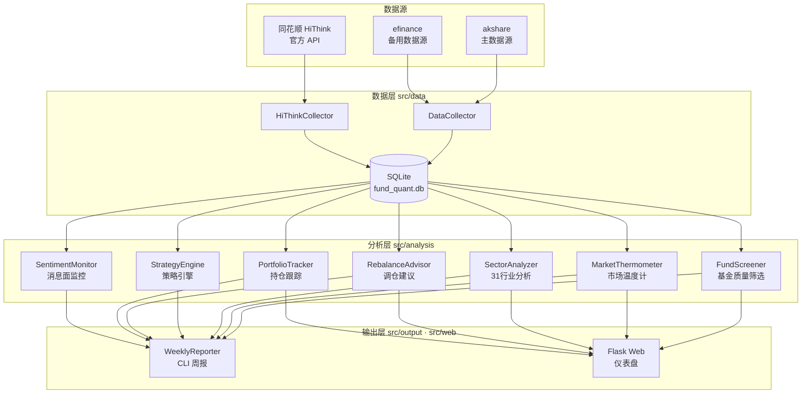

# 自动化基金量化系统

> 🎓 大学生量化基金投资助手 | 场外基金 · 每周信号 · 半自动执行

## 这是什么？

一个面向**个人投资者（尤其是资金有限的大学生）**的量化基金分析工具。

**它做什么**:
- 📡 自动采集全市场基金数据、指数估值、行业行情（akshare / efinance / 同花顺官方 API 三数据源）
- 🔍 基金质量筛选：基于费率、规模、经理稳定性等多维检查输出三色评级（🟢稳健 / 🟡注意 / 🔴高风险）
- 🌡️ 计算"市场温度"，判断当前是便宜还是贵（PE/PB 分位 + 股债性价比 + 成交量 + 情绪五维）
- 📊 31 个申万行业板块动量排名 + 超跌候选
- 🔄 严谨回测引擎 v3：防未来函数（扩展窗口分位数）+ 完整交易成本 + 多基准对比 + alpha 显著性检验
- 📋 跟踪你的持仓，实时计算收益和风险（DB 净值过旧时自动从 akshare 拉最新），输出调仓建议
- 📅 定投（DCA）管理：登记计划、按交易日自动排期、到期提醒、一键执行并累计
- ✏️ 持仓可增删改（buy / sell / update / delete），方便更正录入错误
- 📝 每周生成操作建议报告，支持 CLI 与 Web 仪表盘两种入口

**它不做什么**:
- ❌ 不自动下单（场外基金不支持API交易）
- ❌ 不预测下周涨跌（短期不可预测）
- ❌ 不承诺稳赚不赔（投资有风险）

## 核心理念

```
用数据替代情绪做基金买卖决策。

不追涨杀跌 → 估值低时多买，估值高时谨慎
不选冠军 → 选综合质量好、费率低的基金
不频繁操作 → 每周看一次，长期持有
```

## 快速开始

### 1. 安装依赖

```bash
pip install -r requirements.txt
```

### 2. 一键初始化（首次使用执行一次）

```bash
python src/main.py init
```

自动完成四步：测试数据接口 → 采集基金列表与指数估值 → 采集基金净值历史 → 补充基金详情（约 5-10 分钟）。

> 也可以分步执行：`python src/main.py test` / `collect` / `nav` / `enrich`

### 3. 查看分析结果

```bash
# 生成完整周报
python src/main.py

# 或者单独查看:
python src/main.py score     # 基金评分排名
python src/main.py temp      # 市场温度
python src/main.py portfolio # 持仓概览
```

### 4. 记录你的操作

```bash
python src/main.py buy       # 记录买入（交互式）
python src/main.py sell      # 记录卖出（交互式）
python src/main.py update    # 修改持仓（投入金额/买入日期）
python src/main.py delete    # 删除持仓（处理重复录入）
python src/main.py dca       # 定投管理（list/add/run/pause/resume）
```

## 项目结构

```
Quantitative-Fund-auto/
├── config/
│   └── settings.yaml            # 配置（因子权重、温度阈值、仓位映射等）
├── docs/                        # 📄 文档
│   ├── 使用指南.md              #   面向使用者的完整教程
│   └── 参考项目复盘-v3阶段借鉴.md #  设计取舍记录
├── src/
│   ├── data/                    # 数据层
│   │   ├── collector.py         #   akshare/efinance 数据采集
│   │   ├── hithink_collector.py #   同花顺官方 API 采集
│   │   └── database.py          #   SQLite 数据库
│   ├── cli/                     # CLI 命令包（按职责拆分）
│   │   ├── data_cmds.py         #   数据采集命令
│   │   ├── analysis_cmds.py     #   分析命令
│   │   ├── backtest_cmds.py     #   回测命令
│   │   └── output_cmds.py       #   输出/操作命令
│   ├── config.py                # 配置中心（settings.yaml 类型化访问）
│   ├── analysis/                # 分析层
│   │   ├── fund_scorer.py       #   基金质量筛选（三色评级）
│   │   ├── thermometer.py       #   市场温度计（5维+分歧检测+风格判断）
│   │   ├── backtest.py          #   严谨回测引擎 v3（防未来函数/多基准/t检验）
│   │   ├── portfolio.py         #   持仓跟踪（实时净值兜底）
│   │   ├── dca.py               #   定投管理（交易日排期/到期/执行）
│   │   ├── strategy_engine.py   #   策略引擎（月频+温度阈值）
│   │   ├── rebalance_advisor.py #   调仓建议
│   │   ├── sentiment_monitor.py #   消息面监控
│   │   ├── sector_analyzer.py   #   31行业板块分析
│   │   ├── historical_recommender.py # 历史回测推荐
│   │   └── investment_plan.py   #   投资计划
│   ├── output/
│   │   └── reporter.py          #   周报生成
│   ├── web/                     # 🌐 Web 仪表盘
│   │   ├── app.py               #   Flask 后端 API
│   │   └── templates/           #   前端页面
│   └── main.py                  # 🚀 主入口（CLI 分发，命令在 src/cli/）
├── tests/                       # ✅ 单元测试（34 个用例）
├── data/                        # 数据库文件（gitignore）
├── requirements.txt
└── README.md
```

## 系统架构



## 技术选型

| 组件 | 选型 | 理由 |
|------|------|------|
| 数据源 | akshare（主）+ efinance（备）+ 同花顺 HiThink API | akshare 免费开源、覆盖全市场基金/指数/行业；efinance 作降级备用；HiThink 官方 API 数据质量更高 |
| 存储 | SQLite | 单机个人使用，零配置零运维；563 只基金 × 净值历史的量级完全够用 |
| 语言 | Python 3.10+ | 金融数据生态成熟（pandas / numpy） |
| CLI | rich | 终端彩色输出、表格、进度条，报告可读性好 |
| Web | Flask | 轻量，单文件即可起服务，适合个人工具 |
| 配置 | YAML | 策略参数（因子权重、温度阈值、仓位映射）与代码分离 |

## 评分模型

基金评分使用6个因子，加权计算:

| 因子 | 权重 | 含义 |
|------|------|------|
| 动量 | 25% | 近3/6/12月收益率 |
| 夏普比率 | 25% | 风险调整后收益 |
| 回撤控制 | 20% | 近1年最大回撤（越小越好） |
| 费率 | 15% | 管理费+托管费（越低越好） |
| 规模 | 10% | 基金规模（2-50亿最佳） |
| 经理稳定性 | 5% | 基金经理任职年限 |

## 市场温度计

| 温度 | 状态 | 建议操作 |
|------|------|----------|
| 0-20°C | 🧊 极冷 | 可大胆加仓 |
| 20-40°C | 💧 偏冷 | 适度加仓 |
| 40-60°C | 🌤️ 适中 | 保持定投 |
| 60-80°C | 🔥 偏热 | 减少买入 |
| 80-100°C | ☀️ 过热 | 考虑减仓 |

## 运行示例

**市场温度计**（`python src/main.py temp`）：

```
🌡️ 市场温度计 v2.0
  [███████████░░░░░░░░░] 56.7°C
  状态: 🌤️ 适中   建议: 正常水平，保持定投
  建议权益仓位: 29.8%

  📊 五维分解:
    PE估值分位数:  63°    PB估值分位数:  30°
    股债性价比:    49°    成交量热度:    91°
    市场情绪:      40°

  🔍 估值分歧度: 显著分歧
  🎨 市场风格: 小盘成长（小盘跑赢大盘 4.4%）
```

**基金质量筛选**（`python src/main.py score`）：

```
🔍 基金质量筛选 v3.0
🌡️ 当前市场温度: 56.7°C — 🌤️ 适中
📊 筛选结果: 30只通过质量筛选
   🟢 稳健: 30只

🟢 稳健:
  002010 中欧瑾通灵活配置混合C  费率0.00%  近3月-1%  回撤3%
  001818 易方达瑞兴混合E       费率0.00%  近3月+1%  回撤2%
  002119 广发安盈混合C         费率0.00%  近3月-0%  回撤1%
  ...
```

**Web 仪表盘**（`python src/main.py web`）：浏览器打开 http://localhost:5020，可视化查看市场温度、仓位建议、基金质量池、31 行业排名等。

## 测试

```bash
python -m unittest discover tests
```

覆盖市场温度计的温度分级、边界值、估值分歧检测等纯逻辑（9 个用例，基于标准库 unittest，无需数据库与网络）。

## 严谨回测（v3.0）

`python src/main.py backtest3`

相比 v1/v2 的规则回测，v3 建立了严谨的回测框架：

| 维度 | 升级 |
|------|------|
| 防未来函数 | PE 温度改用**扩展窗口分位数**（只用当日及之前数据），信号不含未来信息 |
| 交易成本 | 申购费 + 赎回费（按持有天数分层）+ 管理费摊销 |
| 多基准 | 沪深300 / 中证500 双基准对比 |
| 统计检验 | 月度 alpha 的 **t 检验**（H0: alpha=0）、Beta 回归 |
| 一致性 | 逐年收益分解，检验策略是否只在某一段有效 |

**回测结果（2021-2026 · 60 个月 · 含交易成本）**：

| 指标 | 策略 | 沪深300 | 中证500 |
|------|------|---------|---------|
| 年化收益 | +0.4% | -0.8% | +1.1% |
| 最大回撤 | 33.2% | 36.5% | 37.6% |
| 月度 alpha | — | +0.32%（p=0.75） | +0.06%（p=0.95） |

**结论：策略的 alpha 均不显著（p >> 0.05），且逐年表现不稳定（第 4 年牛市大幅跑输基准）——「温度→仓位」策略未产生统计上可验证的超额收益。**

### 策略改进验证（backtest4 · 三组对照）

基于负结果提出假设「选基权重过度防御导致牛市跑输」，并做对照实验验证：

| 策略 | 年化 | 夏普 | 最大回撤 | 月胜率 | alpha(p) |
|------|------|------|---------|--------|----------|
| 买入持有（基线） | +2.6% | 0.09 | 49.3% | 40% | +0.50%（0.51） |
| 温度阈值调仓（现状） | +0.4% | 0.01 | 33.2% | 63% | +0.32%（0.75） |
| 温度自适应选基（改进） | -5.5% | -0.21 | 33.8% | 63% | -0.23%（0.81） |

**研究结论**：
1. 改进假设**被证伪**——「温度自适应选基」后年化反而更差（-5.5%），说明问题不在选基权重
2. 主动调仓的真实价值是**降低回撤**（49.3%→33.2%）与提高月胜率（40%→63%），但代价是牺牲收益
3. 所有策略 alpha 均不显著——样本期内无统计上可验证的超额收益

> 这组对照展示了量化研究的完整闭环：假设 → 严谨验证 → **证伪** → 修正认知。结论：主动调仓不能创造 alpha，但能改善风险特征（降回撤）。

## 你的使用场景

既然你通过支付宝买场外基金:

1. **每周日**运行 `python src/main.py` 查看报告（或 `python src/main.py schedule` 定时自动生成）
2. 如果市场温度低+推荐基金评分高 → 考虑在支付宝买入
3. 如果市场温度高 → 减少买入或赎回部分转货币基金
4. 用 `python src/main.py buy/sell` 记录操作，跟踪收益

## 当前约束（v0.1）

- 初始资金: ~1,000元（大学生友好）
- 交易渠道: 支付宝场外基金（手动操作）
- 调仓频率: 每周
- 收益目标: 年化5-10%
- 最大回撤: 20-25%
- 个人自用

## 重要提示

⚠️ **本系统仅供学习参考，不构成投资建议。**
- 历史表现不代表未来收益
- 量化模型可能失效
- 投资有风险，入市需谨慎
- 场外基金T+1确认，短线操作成本高
- 🔒 **隐私说明**：`src/analysis/investment_plan.py` 中的投资计划为个人真实使用数据
  （基金代码/金额/日期，无账号与身份信息）。若公开本仓库请注意此信息；
  如需脱敏，可将真实计划抽到本地 gitignore 的配置文件（如 `config/investment_plan.local.yaml`）。

## License

MIT — 个人学习项目
